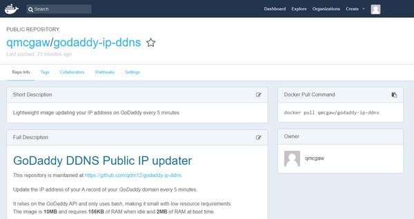

# GoDaddy DDNS Public IP updater

Update the IP address of your A record of your *GoDaddy* domain every 5 minutes.

It uses bash and curl to communicate with the GoDaddy API, and is based on [Alpine](https://hub.docker.com/_/alpine/).
The image is **10MB** and requires **6MB** of RAM.

## Installation

### GoDaddy credentials

[](https://godaddy.com)

1. Login to [https://developer.godaddy.com/keys](https://developer.godaddy.com/keys/) with your account credentials.

[](https://developer.godaddy.com/keys)

2. Generate a Test key and secret.

[](https://developer.godaddy.com/keys)

3. Generate a **Production** key and secret.

[](https://developer.godaddy.com/keys)

Obtain the **key** and **secret** of that production key.

In this example, the key is `dLP4WKz5PdkS_GuUDNigHcLQFpw4CWNwAQ5` and the secret is `GuUFdVFj8nJ1M79RtdwmkZ`.

### Option 1 of 2: Docker container

[](https://www.docker.com/)

1. Make sure you have [Docker](https://docs.docker.com/install/) installed
2. Obtaining the Docker image
    - Option 1 of 2: Docker Hub Registry
        1. You can check my [Docker Hub page](https://hub.docker.com/r/qmcgaw/godaddy-ip-ddns/) for more information.
            
            [](https://hub.docker.com/r/qmcgaw/godaddy-ip-ddns/)
        
        2. In a terminal, download the image (10MB) with:
            ```bash
            sudo docker pull qmcgaw/godaddy-ip-ddns
            ```
    - Option 2 of 2: Build the image
        1. Download the repository files or `git clone` them
        2. With a terminal, go in the directory where the *Dockerfile* is located
        3. Build the image with:
            ```bash
            sudo docker build -t qmcgaw/godaddy-ip-ddns ./
            ```
3. Launching the Docker container from the image (replace the values below):
    ```bash
    sudo docker run -d --name=godaddyddns --restart=always -e 'DOMAIN=mydomain.com' -e 'KEY=dLP4WKz5PdkS_GuUDNigHcLQFpw4CWNwAQ5' -e 'SECRET=GuUFdVFj8nJ1M79RtdwmkZ' -e 'NAME=@' -e 'DELAY=1200' qmcgaw/godaddy-ip-ddns
    ```

Note that we set the following container environment variables with the flag `-e`:

| **Environement variable** | **Value** | *Optional* |
| --- | --- | --- |
| DOMAIN | Domain name | No |
| KEY | Production key's key | No |
| SECRET | Production key's secret | No |
| NAME | @ | **Yes**, defaults to `@` |
| DELAY | 1200 | **Yes**, defaults to `300` |

You can also run the container interactively to test it with:
```bash
sudo docker run --rm --name=godaddyddnsTEST -e 'DOMAIN=mydomain.com' -e 'KEY=dLP4WKz5PdkS_GuUDNigHcLQFpw4CWNwAQ5' -e 'SECRET=GuUFdVFj8nJ1M79RtdwmkZ' -e 'NAME=@' -e 'DELAY=1200' qmcgaw/godaddy-ip-ddns
```

### Option 2 of 2: using the Shell script godaddyddns.sh

1. Set the necessary variables:
    - Option 1 of 2: Set environment variables with a terminal:
        ```bash
        DOMAIN=mydomain.com
        KEY=dLP4WKz5PdkS_GuUDNigHcLQFpw4CWNwAQ5
        SECRET=GuUFdVFj8nJ1M79RtdwmkZ
        NAME=@ # optional
        DELAY=1200 # optional
        ```
    - Option 2 of 2: Set variables in the shell script *godaddyddns.sh*
        1. Copy the following block of code:
            ```shell
            DOMAIN=mydomain.com
            KEY=dLP4WKz5PdkS_GuUDNigHcLQFpw4CWNwAQ5
            SECRET=GuUFdVFj8nJ1M79RtdwmkZ
            NAME=@ # optional
            DELAY=1200 # optional
            ```
        2. Paste it after the first line `#!/bin/bash`
2. Make the script executable with:
    ```bash
    sudo chmod +x godaddyddns.sh
    ```
3. Test the script by running it with:
    ```bash
    ./godaddyddns.sh
    ```
    Refer to the [Testing](#Testing) section to see the result.

4. Run the shell script with [screen](https://www.gnu.org/software/screen/) for example or as a service.

## Testing

With a browser, go to https://dcc.godaddy.com/manage/**yourdomain.com**/dns and check the **Value** of the record of type **A** is set to your [current IP address](https://www.whatismyip.com/)


You might want to try to change the IP address to another one to see if the update actually occurs.